# Kitty Den - A Cat Care Company
(Developer: Hannah Bowles)

[Live webpage](https://hanmb17.github.io/CI_MS1_CATTERY/)

Welcome to the website for Kitty Den (a cat care company) it's been designed to provide a user-friendly experience for all visitors, with a responsive layout that adapts seamlessly to any device. The site gives easy access to information on their cat care services, staff profiles, customer testimonials and contact details.

## Table of Content

1. [Project Goals](#project-goals)
    1. [User Goals](#user-goals)
    2. [Site Owner Goals](#site-owner-goals)
2. [User Experience](#user-experience)
    1. [Target Audience](#target-audience)
    2. [User Requirements and Expectations](#user-requirements-and-expectations)
    3. [User Stories](#user-stories)
3. [Design](#design)
    1. [Design Choices](#design-choices)
    2. [Colours](#colours)
    3. [Fonts](#fonts)
    4. [Structure](#structure)
    5. [Wireframes](#wireframes)
4. [Technologies Used](#technologies-used)
    1. [Languages](#languages)
    2. [Frameworks and Tools](#frameworks-and-tools)
5. [Features](#features)
6. [Testing](#testing)
    1. [HTML Validation](#HTML-validation)
    2. [CSS Validation](#CSS-validation)
    3. [Accessibility](#accessibility)
    4. [Performance](#performance)
    5. [Device testing](#performing-tests-on-various-devices)
    6. [Browser compatibility](#browser-compatibility)
    7. [Testing user stories](#testing-user-stories)
8. [Bugs](#bugs)
9. [Deployment](#deployment)
10. [Credits](#credits)
11. [Acknowledgements](#acknowledgements)

## Project Goals

The primary goal is to provide a user-friendly experience for all visitors with a responsive layout that adapts seamlessly to any device. We offer easy access to information on our cat care services, staff profiles, customer testimonials, and contact details.

### User Goals
- A well-displayed and easy-to-navigate website
- Clear and informative information on what services are on offer
- Clear pricing information
- Easy to find contact information
- Easy to distinguish call-to-action buttons that make sense
- Find out information about the staff and their experience
- Find out the location of Kitty Den

### Site Owner Goals
- Increase in the number of customers
- Promote the business
- Provide multiple ways for customers to contact Kitty Den
- Display clear pricing information
- Provide a simple breakdown of services on offer
- Provide information about our staff and our history

### Developer Goals
- Creating an excellent user experience for the target audience, cat owners looking for cat care services. 
- Provide a simple and intuitive navigation system, quickly and easily find relevant information, such as services and contact detailss.
- Create a visually appealing and reponsive design regardless of screen size.
- Provide simple content that the user can skim read, ensuring accessibility.
 
## User Experience

### Target Audience
- Cat owner looking for cat care - overnight, home visits and daycare
- Cat owner looking for a dedicated cat-only care service
- Cat owner going away on holiday in need of cat care

### User Requirements and Expectations
- A simple and intuitive navigation system
- Quickly and easily find relevant information
- Links and functions that work as expected
- Good presentation and a visually appealing design regardless of screen size
- An easy way to contact the business
- Simple content that the user can skim read
- Accessibility

### User Stories

#### First-time User 
1. As a first-time user, I want to know where the Kitty Den is located.
2. As a first-time user, I want to know what their customer think about them.
3. As a first-time user, I want to know more about their services and prices.
4. As a first-time user, I want to know about the staff at Kitty Den.
5. As a first-time user, I want easily find out how to contact them.
6. As a first-time user, I want to see what type of environment the cattery has to offer and if it is suitable, safe and stimulating for my cat.

#### Returning User
7. As a returning user, I want to know the opening times.
8. As a returning user, I want to find a phone number to call for a booking.
9. As a returning user, I want to see the pricing.
10. As a returning user, I want to know what the services are.
11. As a returning user, I want to get directions to Kitty Den.

#### Site Owner 
12. As the site owner, I want the urers to learn about our history.
13. As the site owner, I want the users to see the cost of our services and what each service includes.
14. As the site owner, I want to make it easy for users to contact us via a variety of methods.
15. As the site owner, I want the users to get introduced to our skilled staff.

## Design

### Design Choices
I wanted to choose colours for Kitty Den from Megatron as he was the inspiration for the website. From a picture of him as a kitten, I picked out his beautiful blue eyes and pink nose as a starting point for the website colours.

Inspiration Image - Megatron as a kitten

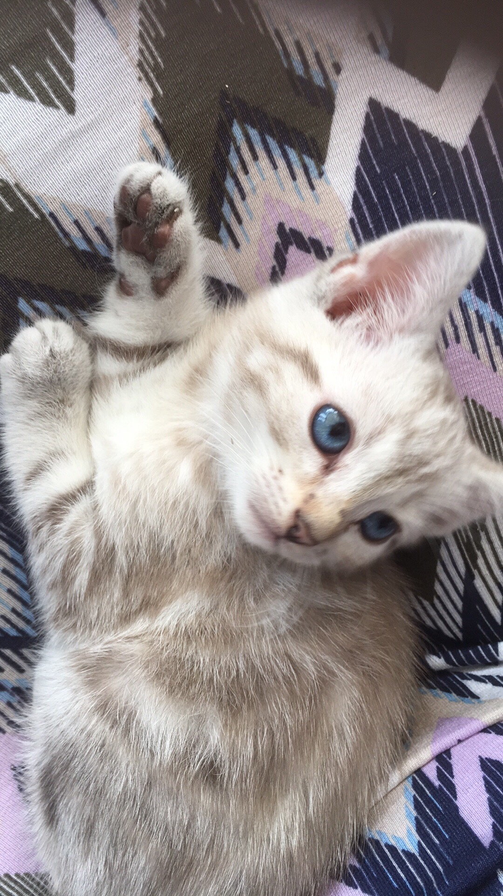

### Colours
Using these colours as a base: 
I chose an off-white for background to help reduce too much glare.

I chose dark blue to allow for good contrast as the primary colour.
Blue is also great for a care company as it gives the feeling of trustworthiness.

I chose a bright dark pink to pop against the white background and the dark blue while giving a playful feel to the site.

Feeling I needed another colour, a bright orange that works as a complementary colour to the blue while working well with the pink was chosen. I used [ColorSpace](https://mycolor.space/) to help find the right orange for the pink. Orange is also great for getting the playful nature of the site across.

#### Branding Colours

- Blue: primary colour: #2E266D
- Pink: secondary colour: #DE1D8D
- Orange: tertiary colour: #FF735C

Branding Colour Ideas

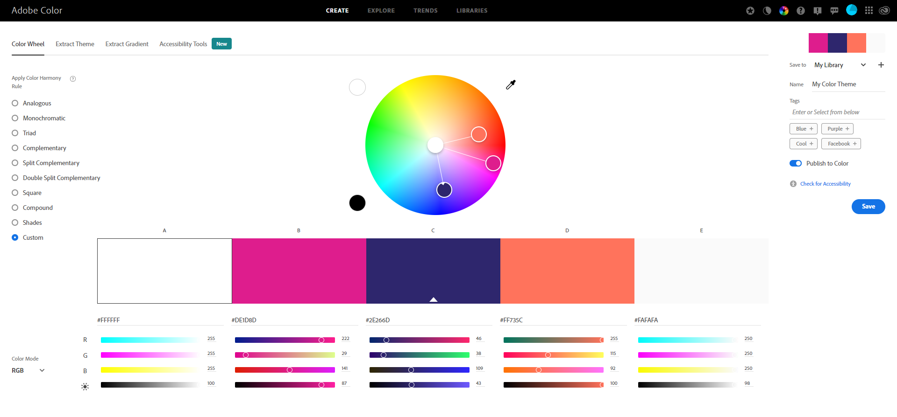

The colours used on the site

- Blue: primary colour: #2E266D
- Pink: secondary colour: #DE1D8D
- Orange: tertiary colour: #FF735C
- Off White: white colour: #FAFAFA;
- Overlay Off White: rgba(250, 250, 250, 0.7) - They off white colour at 70% opacity
- White: #FFFFFF - Used for contrast against the pink and off-white background
- Opaque Pink: rgba(222, 29, 141, 0.5) - Used for style elements to give a pop of colour
- Light Orange: #ffd6d0 a shade of the orange tertiary colour to brighten areas.

I tested multiple options of blue and pink before choosing them and building the full-colour scheme around them to ensure I was happy with the colours and felt I had the best colours to match the site's requirements while remaining accessible. 

I used the abode colour wheel and ColorSpace to decide on the final colours and test the contrast of the colours with the Abode's accessibility tools and tested on the live site with the WebAIM Wave tool.

Branding Colour Website Colours

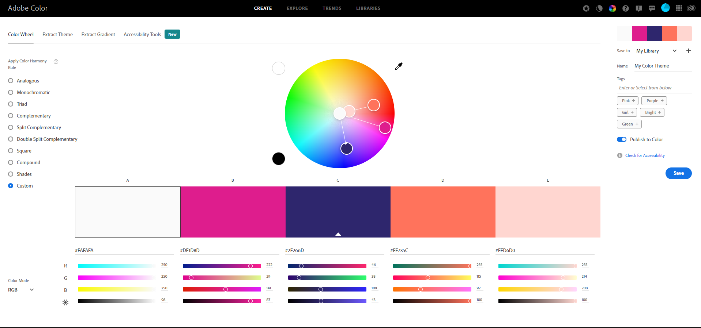

 

#### Colour Contrast Tests

Blue font on off white background

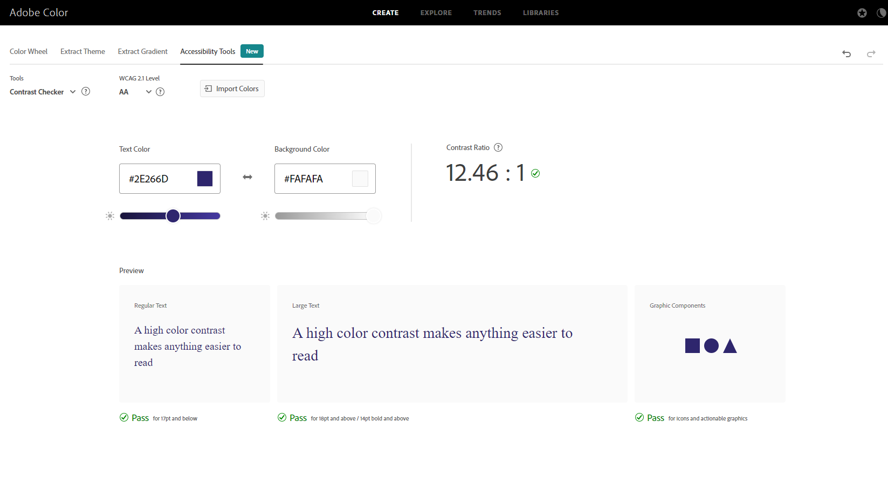

Off white font on blue background

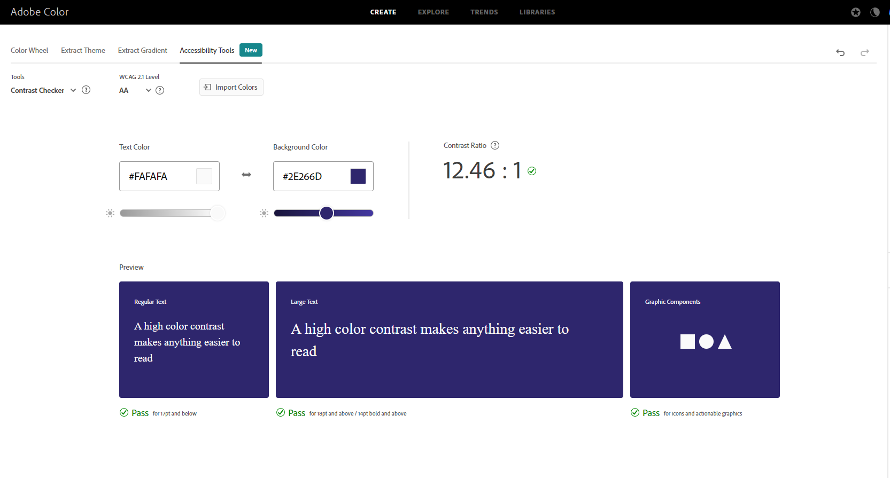

Blue font on light orange background

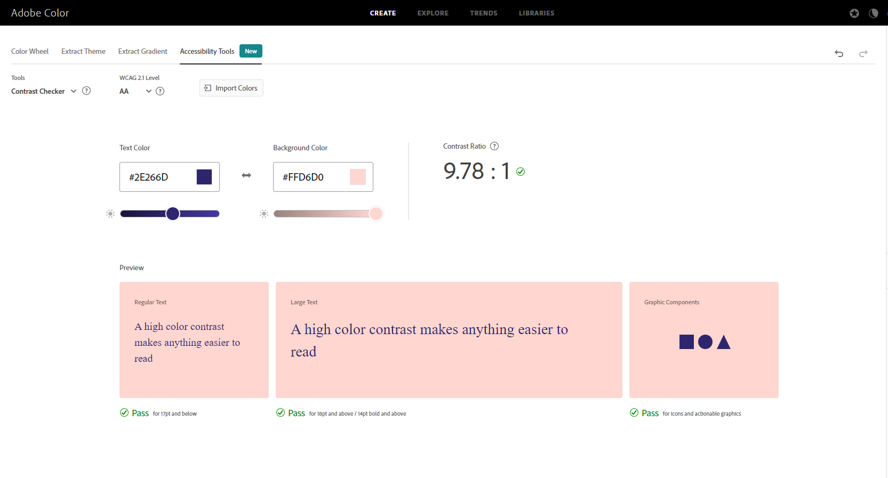

Off white font on pink background - failed test

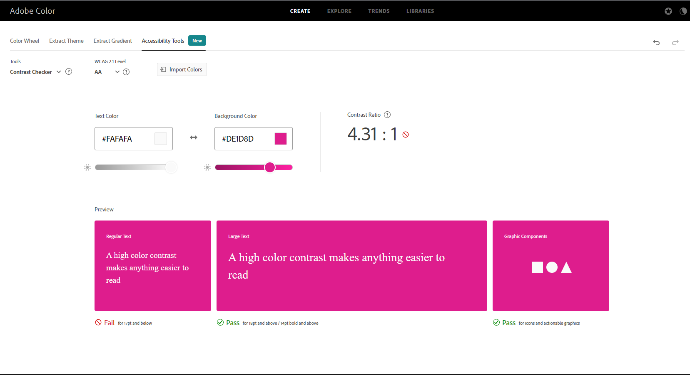

white font on pink background - passed test

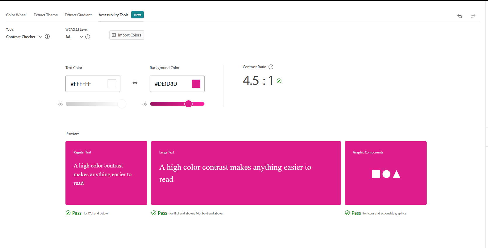

### Fonts
Google Fonts is used to import the 'Indie Flower and Urbanist' font used throughout the website:
- [Indie Flower](https://fonts.google.com/specimen/Indie+Flower) 
- [Urbanist](https://fonts.google.com/specimen/Urbanist)
  
Indie Flower is predominantly used for headers and areas selected for styling, such as people's names. It helps them stand out and appear different from the other text on the site to make an instant impact as the user lands on the page.
 
Urbanist is used for the body of the text to make it easy to read and provides a modern look while offering a visual contrast against Indie Flower.
 
I picked these fonts as Indie Flower offers a playful and personal feel to the site, while Urbanist provides a clean, easy-to-read font with a sleek appearance. Together they work in harmony to portray the playful and professional feel of the company.

### Structure
The page's structure is in well-known, user-friendly and visually attractive way. On arriving, the user sees a recognisable navigation bar which on smaller displays is a hamburger menu to the right and the company's logo on the left. The website consists of six separate pages:
 
- Homepage - with the following sections unique selling points, intro to Kitty Den and customer testimonials. 
- About Us - Includes an intro into what they are, the history and conception of the company in a timeline style and a meet-the-staff carousel.
- Gallery - With information about the resident cats and images showcasing cats enjoying Kitty Den services
- Services - Simple and clean pricing cards with service detail included.
- Contact Us - Map of Kitty Den's location, Contact form and other contact and business information. 
- 404 - An image depicting the landing on a 404 page with a redirection button to help users find their way back.

### Wireframes

Home

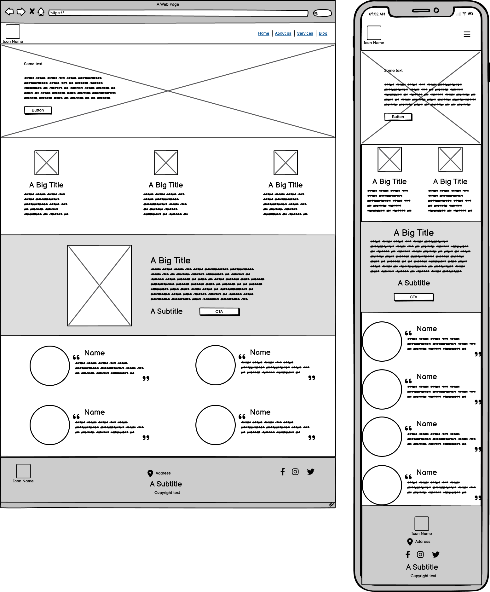

About Us

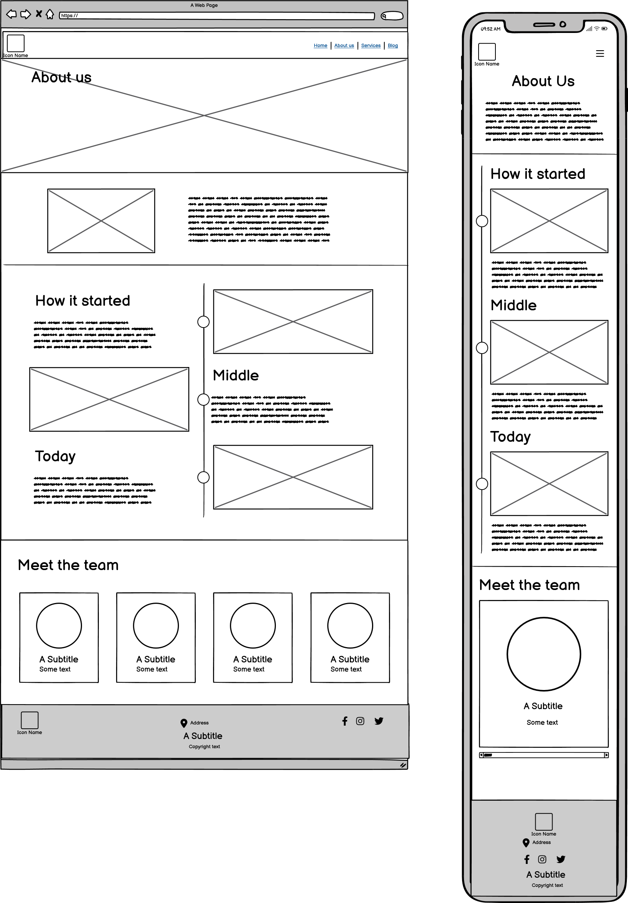

Services / Prices

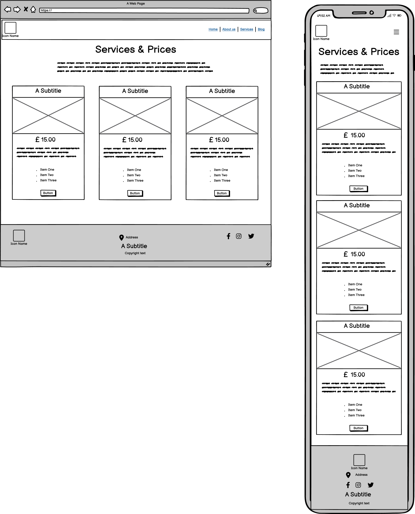

Gallery

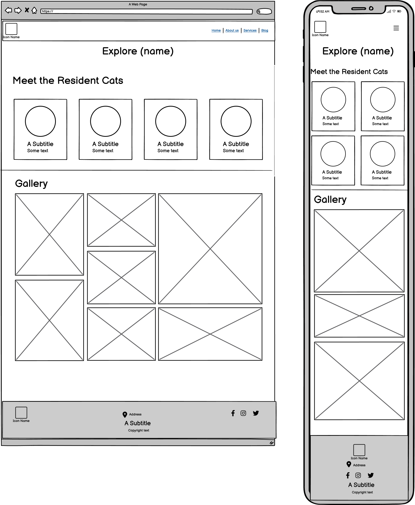

Contact Us

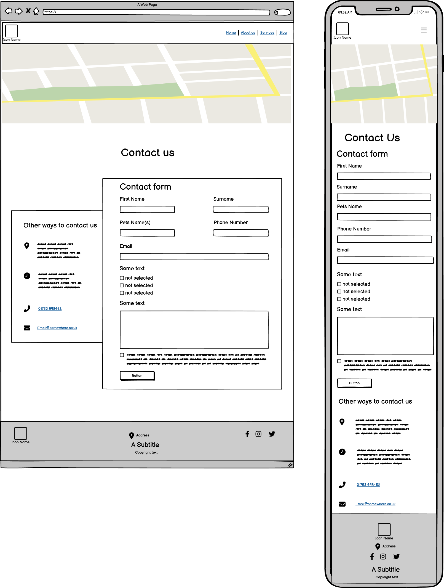

## Technologies Used

### Languages
- [HTML](https://en.wikipedia.org/wiki/HTML)
- [CSS](https://en.wikipedia.org/wiki/CSS)

### Frameworks and Tools
- [Bootstrap v5.3](https://getbootstrap.com/)
- [Git](https://git-scm.com/)
- [Github](https://github.com/)
- [GitPod](https://www.gitpod.io/)
- [Tiny PNG](https://tinypng.com/)
- [Balsamiq](https://balsamiq.com/wireframes/)
- [Google Fonts](https://fonts.google.com/about)
- [Font Awesome](https://fontawesome.com/search)
- [Code Pen](https://codepen.io/)
- [Affinity Developer 2 and Photo 2](https://affinity.serif.com/en-gb/)
- [Grammarly](https://www.grammarly.com/)
- [W3C validator](https://validator.w3.org/)
- [Jigsaw CSS validator](https://jigsaw.w3.org/css-validator/)
- [WAVE Web Accessibility Evaluation Tool](https://wave.webaim.org/)

## Features
The page consists of six pages and 16 features.

### Logo and Navigation Bar (Header)
- Featured on all six pages
- The navigation bar is designed to be fully responsive for all screen sizes. It changes to a toggler (hamburger menu) on smaller screens. The following links are included: About Us page, Services & Prices page, Gallery Page and the Contact Us page.
- Users can easily navigate the site with its user-friendly interface.
- The link for the page the user is currently on is bold and underlined in pink.
- On smaller devices, the hamburger menu animates to a pink cross button to easily identify how to close the menu.
- The left includes Kitty Den's logo, which acts as a home button.
- User stories covered: 1, 2, 3, 5, 6, 8, 9, 10, 13.

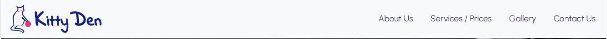

### Hero Image / Landing Page
- Header and tagline to make it clear what Kitty Den is and offers
- The background image of Megatron in black and white with only his blue eyes and pink nose in colour to not distract too much from the text but reinforce the branding colours.
- A clear call to action button to direct the users to the services on offer. 
- User stories covered: 

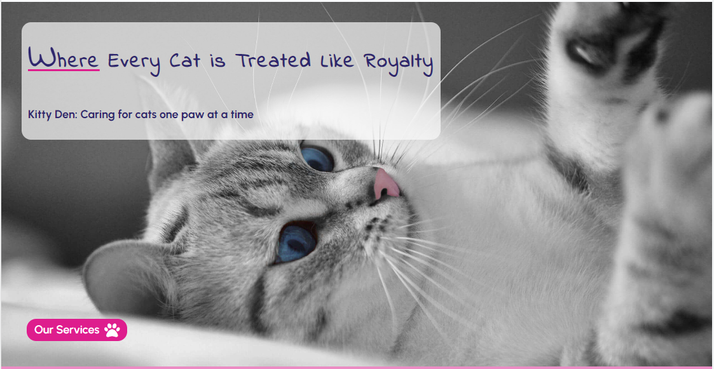

### Unique selling points 
- Introduces the user to the benefits of using Kitty Den.
- Icons are used to visually display the benefits with a header and short sentences to reinforce what Kitty Den offers.
- User stories covered:

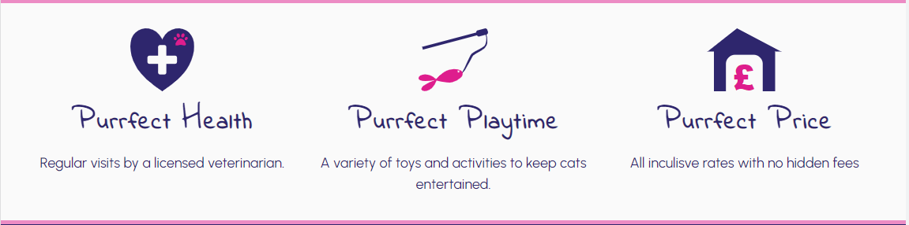

### Intro Section
- Introduces Kitty Den to the user and what they are.
- The Call to action button allows the user to go straight to the contact us page, helping to make conversions quicker.
- User stories covered.

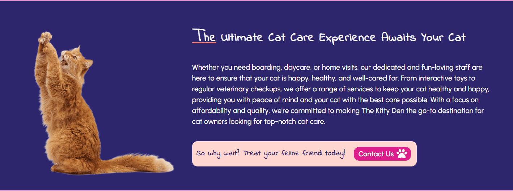

### Testimonials 
- Featuring four customer reviews that highlight how using the Kitty Den has benefited them and their cat.
- The profile picture of the reviewer with their cat helps the user relate to them.
- All services are reviewed, introducing the users to the services.
- User stories covered: 

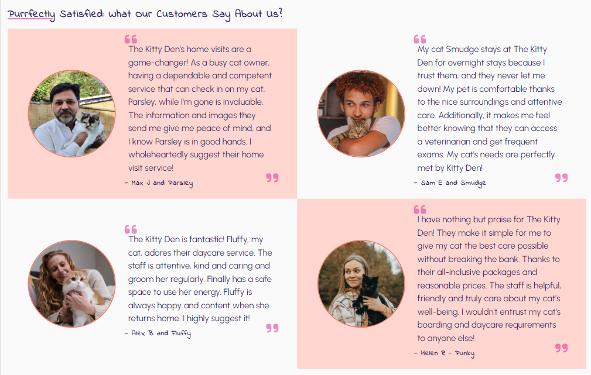

### Footer
- Featured on all six pages.
- Logo to reinforce what company page they are on.
- Kitty Dens Address, lets the iser know where Kitty Den is located.
- Social Media links 
- User stories covered: 

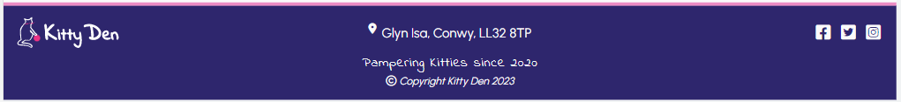

### About Us - Kitty Den Description 
- Introduces the user to Kitty Den and what they are in clear and easy-to-read text.
- A colourful hero image is used of a group of cats looking happy and playful.
- On larger screens, there is an image of a cat playing with toys, but it is not visible on mobile view. It helps to create balance on the desktop screen.
- User stories covered:

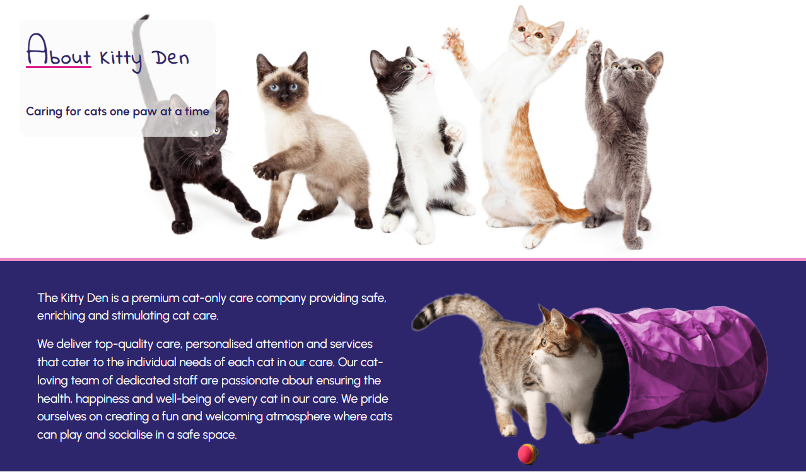

### Kitty Den Timeline
- The timeline lets the user discover more about Kitty Den and how the business started.
- Each timeline point content is displayed in separate cards to make them easily distinguishable. 
- Each card has a title, a tagline and easy-to-read text to help the user follow Kitty Den's story easily.
- Every card contains an image that relates to the title and text, providing a visual narrative for the user.
- User stories covered:

### Staff Carousel
- Users can view the staff members who work at Kitty Den.
- Shows the user what qualifications, skills and personalities of the staff.
- The carousel is a user-friendly feature that allows for easy browsing of staff members without taking up excessive vertical space on mobile devices, leading to an enhanced user experience.
- Having profile images helps users become more familiar with the staff.
- When viewing the profile on a desktop, cat ears and whiskers will appear when hovering over the image. This playful feature reinforces the company's fun nature. On smaller devices, the ears and whiskers are always visible.
- User stories covered:

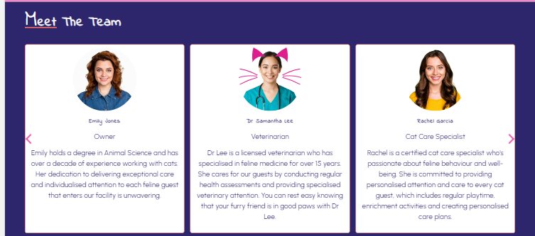

### Our Services and Prices Cards
- The cards display the available services and their prices to the user.
- A simple graphic to prevent distracting the user from the services information but allow for visual interest.
- A call to action button linking to the contact us page allows the user to get to the Contact page quickly.
- A list of bullet points provides a clear and concise overview of each service's offerings, enabling the user to understand what each service offers.
- User stories covered:

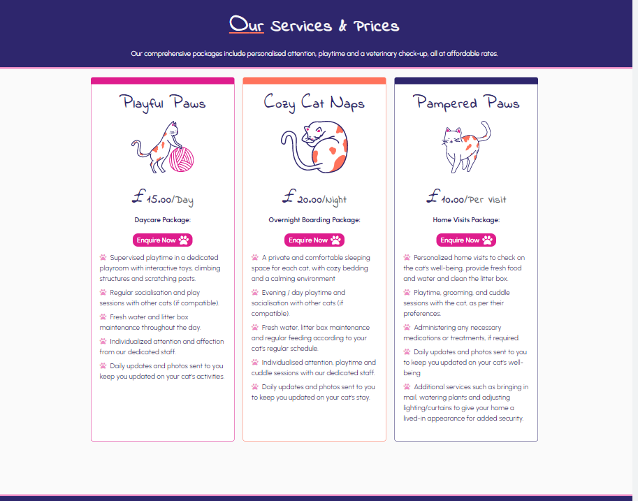

### Meet The Resident Cats
- Shows the users what cats will already be at Kitty Den.
- Gives users an insight as to what type of cats they are used to reassure the user they are used to looking after cats.
- User stories covered: 

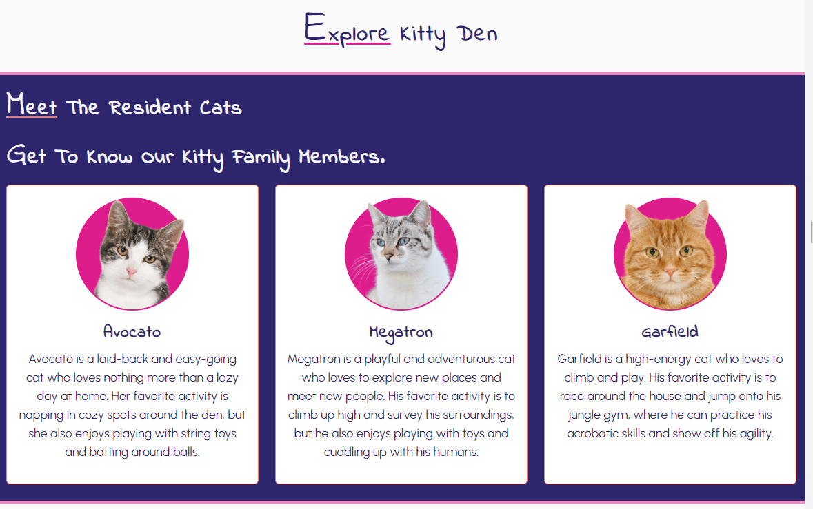

### Gallery
- Allows the user to see inside the Kitty Den.
- Shows the user what they can expect whilst their cat is in Kitty Den's care.
- Shows the user cats using and enjoying the services.
- User stories covered:

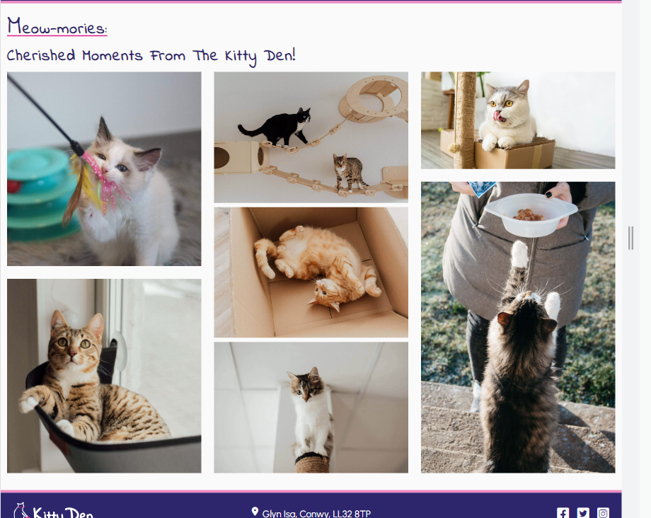

### Google Map
- Show the user the location of Kitty Den.
- Allows the user to get click-through and get directions to Kitty Den.
- User stories covered:

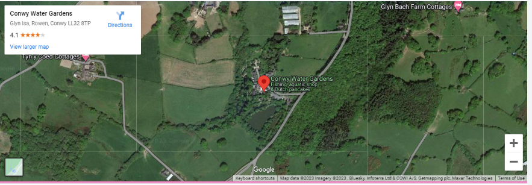

### Contact Form
- Allows the user to fill in a contact form to get contacted by Kitty Den for their enquiry
- The service checkbox list allows the user to pick what services they are interested in
- User stories covered:

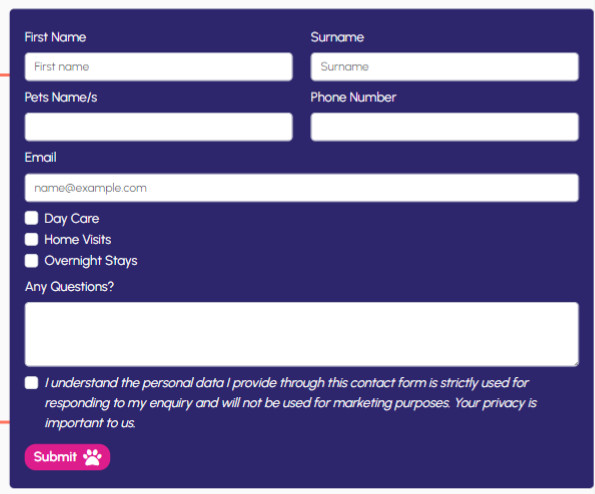

### Business Information and Other Contact Ways
- Provides the user with more company information
- Gives the user the address of Kitty Den
- Shows the user the Kitty Den's main opening times
- Provides the user with a clickable contact number for Kitty Den to make it more convenient for them to call.
- Provides the user with a clickable email address to send Kitty Den an email.
- The purpose of adding this section is to give other contact options for the users.
- User stories covered:

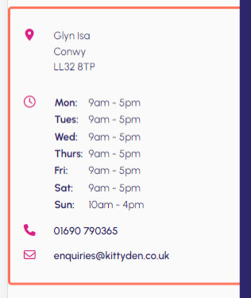

### 404
- For a company based 404 page.
- Includes navigation bar to allow users to navigate where they want.
- A button for the user to quickly navigate back to the home page.

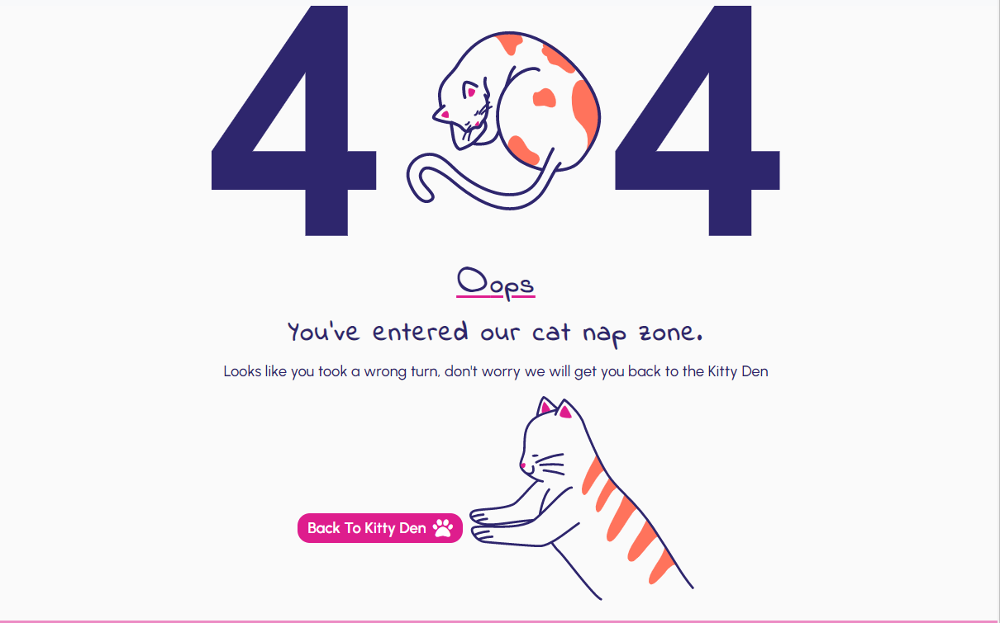

## Testing

### HTML Validation
The W3C Markup Validation Service was used to validate the HTML of the website. All pages pass with no errors.

index.html - [Results](https://validator.w3.org/nu/?doc=https%3A%2F%2Fhanmb17.github.io%2FCI_MS1_CATTERY%2Findex.html)

about.html - [Results](https://validator.w3.org/nu/?doc=https%3A%2F%2Fhanmb17.github.io%2FCI_MS1_CATTERY%2Fabout.html)

services.html - [Results](https://validator.w3.org/nu/?doc=https%3A%2F%2Fhanmb17.github.io%2FCI_MS1_CATTERY%2Fservices.html)

gallery.html - [Results](https://validator.w3.org/nu/?doc=https%3A%2F%2Fhanmb17.github.io%2FCI_MS1_CATTERY%2Fgallery.html)

contactus.html - [Results](https://validator.w3.org/nu/?doc=https%3A%2F%2Fhanmb17.github.io%2FCI_MS1_CATTERY%2Fcontactus.html)

404.html - [Results](https://validator.w3.org/nu/?doc=https%3A%2F%2Fhanmb17.github.io%2FCI_MS1_CATTERY%2F404.html)

### CSS Validation
The W3C Jigsaw CSS Validation Service was used to validate the CSS of the website.

When using the URL in my index.html, 17 Parse Errors and 8 Value Error: color Invalid RGB function, errors were returned, all linked to Bootstrap and as 422 warnings 6 for my CSS and 418 for Bootstrap.

style.css - [Results](https://jigsaw.w3.org/css-validator/validator?uri=https%3A%2F%2Fhanmb17.github.io%2FCI_MS1_CATTERY%2Findex.html&profile=css3svg&usermedium=all&warning=1&vextwarning=&lang=en)

When validating pasting my custom CSS, it passed with no errors and flagged some warnings. One for the checkbox border and background colour - as this is styling I have left them as they are. Some for the moz and webkit transitions and transforms used, 1 for variables not checked and one warning for the Google fonts import used.

style.css - [Results](https://jigsaw.w3.org/css-validator/validator)

### Accessibility
The WAVE WebAIM web accessibility evaluation tool was used to ensure the website met high accessibility standards. All pages pass with 0 errors.

index.html - [Results](https://wave.webaim.org/report#/https://hanmb17.github.io/CI_MS1_CATTERY/index.html)

about.html - [Results](https://wave.webaim.org/report#/https://hanmb17.github.io/CI_MS1_CATTERY/about.html)

services.html - [Results](https://wave.webaim.org/report#/https://hanmb17.github.io/CI_MS1_CATTERY/services.html)

gallery.html - [Results](https://wave.webaim.org/report#/https://hanmb17.github.io/CI_MS1_CATTERY/gallery.html)

contactus.html - [Results](https://wave.webaim.org/report#/https://hanmb17.github.io/CI_MS1_CATTERY/contactus.html)

404.html - [Results](https://wave.webaim.org/report#/https://hanmb17.github.io/CI_MS1_CATTERY/404.html)

### Performance 
Google Lighthouse in Google Chrome Developer Tools was used to test the performance of the website pages. All pages perform well.

index.html - [Results](https://pagespeed.web.dev/analysis/https-hanmb17-github-io-CI_MS1_CATTERY-index-html/9gto311wmm?form_factor=desktop)

about.html - [Results](https://pagespeed.web.dev/analysis/https-hanmb17-github-io-CI_MS1_CATTERY-about-html/n0jtyrecrt?form_factor=desktop)

services.html - [Results](https://pagespeed.web.dev/analysis/https-hanmb17-github-io-CI_MS1_CATTERY-services-html/75rhhakrec?form_factor=desktop)

gallery.html - [Results](https://pagespeed.web.dev/analysis/https-hanmb17-github-io-CI_MS1_CATTERY-gallery-html/3ed5r8n46h?form_factor=desktop)

contactus.html - [Results](https://pagespeed.web.dev/analysis/https-hanmb17-github-io-CI_MS1_CATTERY-contactus-html/fmlhc4rsrn?form_factor=desktop)

404.html - [Results](https://pagespeed.web.dev/analysis/https-hanmb17-github-io-CI_MS1_CATTERY-404-html/99ounqxrci?form_factor=desktop)

### Performing tests on various devices
The website was tested on the following devices:
- Lenovo L340
- iPad Mini 
- iPhone 8
- Google Pixel 7

In addition, Google Chrome Developer Tools device toggle, was used to test the website for all available device options and the responsive website design tester.

### Browser compatibility
The website was tested on the following browsers:
- Google Chrome
- Apple Safari
- Mozilla Firefox
- Microsoft Edge

### Testing user stories

#### First-time User

1. As a first-time user, I want to know where the Kitty Den is located.

| Feature     | Action      |  Expected Result  | Actual Result |
|    :----:      |    :----:   |   :----:   |  :----: |
| Map     | Navigate to the Contact Us page and locate the Google Map | Locates a map showing the location of Kitty Den  | Works as expected  |
| Address On Footer  | On any page scroll down to the footer | Find the address of the Kitty Den  |  Works as expected  |

Video of users finding the map

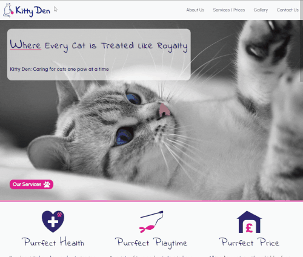

Video of users finding the address on the footer

2. As a first-time user, I want to know what their customer think about them.

| Feature     | Action      |  Expected Result  | Actual Result |
|    :----:      |    :----:   |   :----:   |  :----: |
| Kitty Den timeline | Navigate to About Us page and locate the history timeline | Locates the timeline showing the history of Kitty Den | Works as expected |

Video of users finding the testomonials

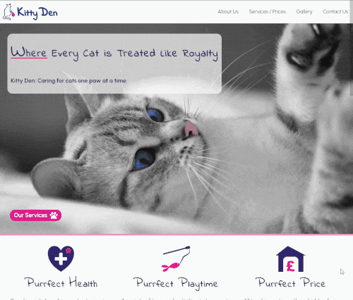

 

3. As a first-time user, I want to know more about their services and prices.

| Feature     | Action      |  Expected Result  | Actual Result |
|    :----:      |    :----:   |   :----:   |  :----: |
| Service / Pricing Cards    | Navigate to the Services / Prices page and locate the cards | Locates the cards detailing the services of Kitty Den  | Works as expected |

Video of users finding the price and service cards

 

4. As a first-time user, I want to know about the staff at Kitty Den.

| Feature     | Action      |  Expected Result  | Actual Result |
|    :----:      |    :----:   |   :----:   |  :----: |
| Meet the staff caraousel  | Navigate to the About Us page and scroll to locate the staff carasouel | Locates the staff carasoul  | Works as expected |

Video of users finding the staff carousel

 

5. As a first-time user, I want easily find out how to contact them.

| Feature     | Action      |  Expected Result  | Actual Result |
|    :----:      |    :----:   |   :----:   |  :----: |
| Contact Us Page  | Navigate to the Contact Us page | Locates the Contact Us page | Works as expected |
| Contact Form | Navigate to the Contact Us page and locate the contact form | Navigates to the Contact Us page and locate the contact form| Works as expected |
| Phone Number | Navigate to the Contact Us page and locate the phone number | Navigates to the Contact Us page and locate the phone number| Works as expected |
| Email address | Navigate to the Contact Us page and locate the email adress | Navigates to the Contact Us page and locate the email address| Works as expected |

Video of users finding the contact form

Video of users finding the other contact ways

 
Screenshot of email address

 
Screenshot of phone number

 

6. As a first-time user, I want to see what type of environment the cattery has to offer and if it is suitable, safe and stimulating for my cat.

| Feature     | Action      |  Expected Result  | Actual Result |
|    :----:      |    :----:   |   :----:   |  :----: |
| Gallery | Navigate to the Gallery page and locate the gallery| Navigates to the Gallery Us page and locate the gallery| Works as expected |

Video of users finding the gallery

#### Returning User

7. As a returning user, I want to know the opening times.

| Feature     | Action      |  Expected Result  | Actual Result |
|    :----:      |    :----:   |   :----:   |  :----: |
| Opening times on Contact Us Page | Navigate to the Contact Us page and locate the opening time| Navigates to the Contact Us page and locates the opening times | Works as expected |

Video of users finding the buiness information

 
Screenshot of opening times
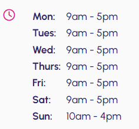

 

8. As a returning user, I want to find a phone number to call for a booking

| Feature     | Action      |  Expected Result  | Actual Result |
|    :----:      |    :----:   |   :----:   |  :----: |
| Opening times on Contact Us Page | Navigate to the Contact Us page and locate the phone number | Navigates to the Contact Us page and locates the phone number| Works as expected |

Video of users finding the other contact ways

 
Screenshot of phone number

 

8. As a returning user, I want to see the pricing.

| Feature     | Action      |  Expected Result  | Actual Result |
|    :----:      |    :----:   |   :----:   |  :----: |
| Service / Pricing Cards    | Navigate to the Services / Prices page and locate the cards | Locates the cards detailing the prices of Kitty Den  | Works as expected |

Video of returning users find the pricing

10. As a returning user, I want to know what the services are.

| Feature     | Action      |  Expected Result  | Actual Result |
|    :----:      |    :----:   |   :----:   |  :----: |
| Service / Pricing Cards    | Navigate to the Services / Prices page and locate the cards | Locates the cards detailing the services of Kitty Den  | Works as expected |

Video of returning users find the service cards

11. As a returning user, I want to get directions to Kitty Den.

| Feature     | Action      |  Expected Result  | Actual Result |
|    :----:      |    :----:   |   :----:   |  :----: |
| Google Map  | Navigate to the Contact Us page and locate the map - click through opens up google maps | Locates the map and clicks through to get directions from google maps | Works as expected |

Video of users finding the map

 

#### Site Owner 

12. As the site owner, I want the urers to learn about our history.

| Feature     | Action      |  Expected Result  | Actual Result |
|    :----:      |    :----:   |   :----:   |  :----: |
| Timeline | Navigate to the About Us page and locates timeline | Locates to the timeline| Works as expected |

Video of users finding the timeline

 

13. As the site owner, I want the users to see the cost of our services and what each service includes.

| Feature     | Action      |  Expected Result  | Actual Result |
|    :----:      |    :----:   |   :----:   |  :----: |
| Service / Pricing Cards    | Navigate to the Services / Prices page and locate the cards | Locates the cards detailing the services of Kitty Den  | Works as expected |

Video of users find the price and service cards

 

14. As the site owner, I want to make it easy for users to contact us via a variety of methods.

| Feature     | Action      |  Expected Result  | Actual Result |
|    :----:      |    :----:   |   :----:   |  :----: |
| Contact Us Page  | Navigate to the Contact Us page | Locates the Contact Us page | Works as expected |
| Contact Form | Navigate to the Contact Us page and locate the contact form | Navigates to the Contact Us page and locate the contact form| Works as expected |
| Phone Number | Navigate to the Contact Us page and locate the phone number | Navigates to the Contact Us page and locate the phone number| Works as expected |
| Email address | Navigate to the Contact Us page and locate the email adress | Navigates to the Contact Us page and locate the email address| Works as expected |

Video of users finding the contact form

Video of users finding the other contact ways

 
Screenshot of email address

 
Screenshot of phone number

 

15. As the site owner, I want the users to get introduced to our skilled staff.

| Feature     | Action      |  Expected Result  | Actual Result |
|    :----:      |    :----:   |   :----:   |  :----: |
| Meet the staff caraousel  | Navigate to the About Us page and scroll to locate the staff carasouel | Locates the staff carasoul  | Works as expected |

Video of users finding the staff carousel

## Bugs

1. A horizontal scroll bar appears on desktop and mobile devices.

On testing the site on different devices and through Google developer tools, I noticed a horizontal scroll bar was on occurring. None of my added content appeared to be overflowing, but with Google Developer tools, I spotted that the .row class from Bootstrap was causing this issue.

I fixed this by adding an m-0 or g-0 class to the div element containing the row class providing an easy fix for the issue as it removed the horizontal margins the row was adding. 

Before fix screenshot

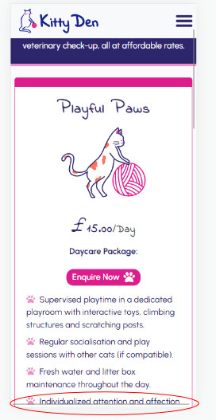

After fix screenshot

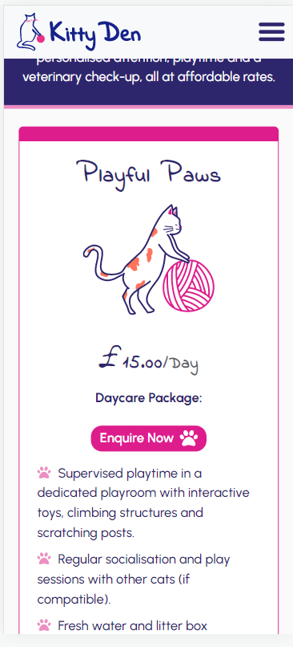

2. The animation for the hamburger menu that appears on hover was happening when the Nav Menu was expanded.

On testing the site on my mobile, I noticed the on-hover effect was happening when the Nav Menu was expanded. I looked at ways to prevent this, but overall I felt this animation added nothing to the website, so I removed it.

Before fix screenshot

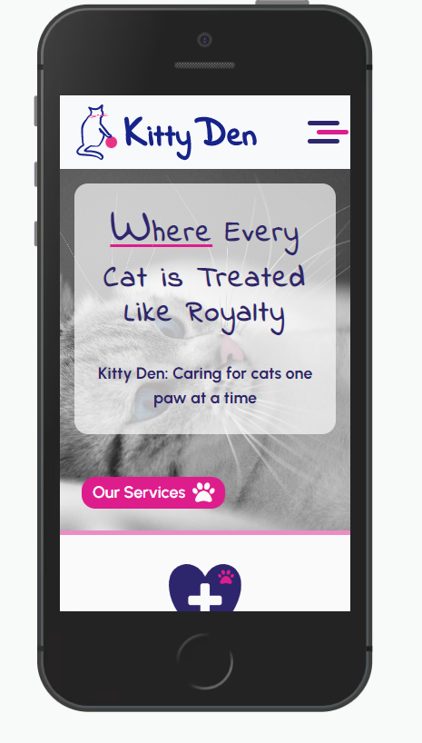

After fix screenshot

3. On testing the site on a Google Pixel 7, I noticed when pressing back to return to a previous page the Hamburger menu, which had transformed, was not re-setting like on other devices. 

I decided the best fix was to remove the checkbox, which I was using to create the transformation - as I felt this was likely causing the problem. I then changed the css to respond to an aria-expanded = true and false. On re-testing, this has fixed the issue and has not created any bugs on the other devices.

Before fix screenshot

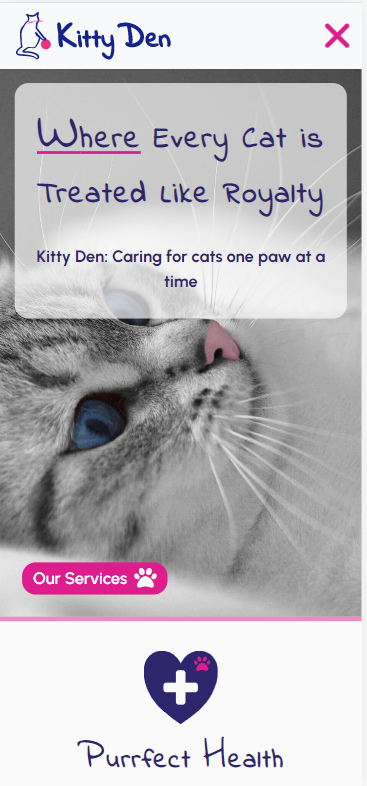

After fix screenshot

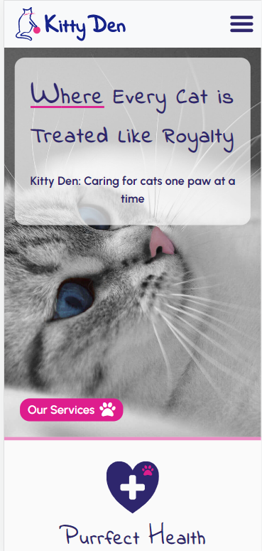

4. When I tested the carousel, I noticed the transition worked well for only two break points but struggled when I added a third.

As I did not want to compromise on the number of cards displayed for each breakpoint, I decided to remove the transitions after trying to fix and adjust them. 

5. When I tested the site on Firefox, the logo was not displaying.

I discovered this was due to width: fit-content. I had a few different options to correct this, but I chose width: auto was the best option, as the width of the logo is based on the declared height of the logo.

Before fix screenshot

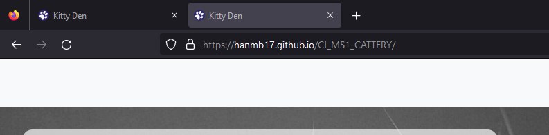

After fix screenshot

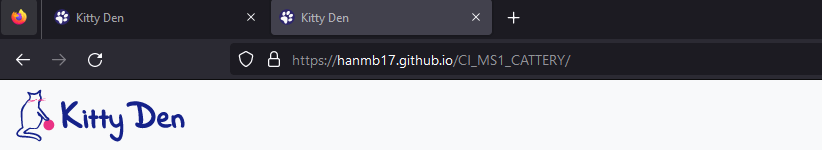

## Deployment
The website was deployed using GitHub Pages by following these steps:
1. In the GitHub repository navigate to the Settings tab
2. On the left-hand menu select Pages
3. For the source select Branch: master
4. After the webpage refreshes automatically you will see a ribbon on the top saying: Your site is live at https://hanmb17.github.io/CI_MS1_CATTERY
 

You can fork the repository by following these steps:
1. Go to the GitHub repository
2. Click on the Fork button in the upper right-hand corner
 

You can clone the repository by following these steps:
1. Go to the GitHub repository
2. Locate the Code button above the list of files and click it
3. Select if you prefer to clone using HTTPS, SSH, or Github CLI and click the copy button to copy the URL to your clipboard
4. Open Git Bash
5. Change the current working directory to the one where you want the cloned directory
6. Type git clone and paste the URL from the clipboard ($ git clone https://github.com/YOUR-USERNAME/YOUR-REPOSITORY)
7. Press Enter to create your local clone

## Credits

### Media

Images where taken from [Canva](https://www.canva.com/), [Stock Adobe](https://stock.adobe.com/uk/), [Pexels](https://www.pexels.com/) and [Pixabay](https://pixabay.com/), credit to the below artists

In order of appearance 

 

| Image     | Page  |  Source | Artist | Edit(s) |
|    :----:   |    :----:   |   :----:   |  :----: | :----: |
|  [Hero image](assets/images/hero-image-megatron.jpg) |  [index.html](https://hanmb17.github.io/CI_MS1_CATTERY/index.html)  |    [Pixabay](https://pixabay.com/)    |     [Annabel_P](https://pixabay.com/users/annabel_p-9567525/)    | Turned to grey scale then blue and pink added |
|  [Cat in intro section](assets/images/ginger-cat-playing.png) |  [index.html](https://hanmb17.github.io/CI_MS1_CATTERY/index.html)  |    [Stock Adobe](https://stock.adobe.com/uk/)  |     [Nndanko](https://stock.adobe.com/uk/contributor/206034927/nndanko?load_type=author&prev_url=detail)    | Backgorund removed |
|  [Max and Parsley](assets/images/max-and-parsley.jpg) |  [index.html](https://hanmb17.github.io/CI_MS1_CATTERY/index.html)  |    [Pexels](https://www.pexels.com/) |     [Altaf Shah](https://www.pexels.com/@altaf-shah-3143825/)    | None |
|  [Sam and Smudge](assets/images/sam-and-smudge.jpg) |  [index.html](https://hanmb17.github.io/CI_MS1_CATTERY/index.html)  |    [Pexels](https://www.pexels.com/) |     [Deni's Fotografia](https://www.pexels.com/es-es/@denigrafias/)    | None |
|  [Alex and Fluffy](assets/images/alex-and-fluffy.jpg) |  [index.html](https://hanmb17.github.io/CI_MS1_CATTERY/index.html)  |    [Pexels](https://www.pexels.com/) |     [cottonbro studio](https://www.pexels.com/@cottonbro/)    | None |
|  [Helen and Punky](assets/images/helen-and-punky.jpg) |  [index.html](https://hanmb17.github.io/CI_MS1_CATTERY/index.html)  |    [Pexels](https://www.pexels.com/) |     [Maksim Goncharenok](https://www.pexels.com/@maksgelatin/)    | None |
|  [About us hero image](assets/images/group-of-cats.jpg) |  [about.html](https://hanmb17.github.io/CI_MS1_CATTERY/about.html)  |    [Stock Adobe](https://stock.adobe.com/uk/) |     [Adogslifephoto](https://stock.adobe.com/uk/contributor/201666757/adogslifephoto?load_type=author&prev_url=detail)    | None |
|  [Cat playing with tunnel](assets/images/cat-playing-with-ball-and-tunnel.png) |  [about.html](https://hanmb17.github.io/CI_MS1_CATTERY/about.html)  |    [Stock Adobe](https://stock.adobe.com/uk/) |     [Africa Studio](https://stock.adobe.com/uk/contributor/293313/africa-studio?load_type=author&prev_url=detail)    | Background removed and tunnel colour change|
|  [Timeline image 1 - sad cat](assets/images/timeline-image-sad-megatron.jpg) |  [about.html](https://hanmb17.github.io/CI_MS1_CATTERY/about.html)  |    [Stock Adobe](https://stock.adobe.com/uk/) |  [IBenmAn](https://stock.adobe.com/uk/contributor/207789813/ibenman?load_type=author&prev_url=detail)    | None |
|  [Timeline image 2 - cat in bed](assets/images/timeline-image-cat-in-bed.jpg) |  [about.html](https://hanmb17.github.io/CI_MS1_CATTERY/about.html)  |    [Stock Adobe](https://stock.adobe.com/uk/) |  [Standret](https://stock.adobe.com/uk/contributor/202439883/standret?load_type=author&prev_url=detail) [Totojang1977](https://stock.adobe.com/uk/contributor/203767798/totojang1977?load_type=author&prev_url=detail)   | Images fused togther - cat placed in bed and backgrounds removed |
|  [Timeline image 3 - cats on climbing wall](assets/images/timeline-image-three-cats-on-climbing-wall.jpg) |  [about.html](https://hanmb17.github.io/CI_MS1_CATTERY/about.html)  |  [Pexels](https://www.pexels.com/)   |  [Arina Krasnikova](https://www.pexels.com/@arina-krasnikova/)    | None |
|  [Timeline image 4 - vet with cat](assets/images/timeline-image-vet-with-cat.jpg) |  [about.html](https://hanmb17.github.io/CI_MS1_CATTERY/about.html)  |    [Stock Adobe](https://stock.adobe.com/uk/) |  [Yakobchuk Olena](https://stock.adobe.com/uk/contributor/205191830/yakobchuk-olena?load_type=author&prev_url=detail)    | None |
|  [Timeline image 5 - happy cat](assets/images/timeline-image-happy-cat.jpg) |  [about.html](https://hanmb17.github.io/CI_MS1_CATTERY/about.html)  |    [Stock Adobe](https://stock.adobe.com/uk/) |  [ksena32](https://stock.adobe.com/uk/contributor/201380829/ksena32?load_type=author&prev_url=detail)   | None |
|  [Emily Jones](assets/images/emily-the-owner.jpg) |  [about.html](https://hanmb17.github.io/CI_MS1_CATTERY/about.html)  |    [Stock Adobe](https://stock.adobe.com/uk/) |  [Deagreez](https://stock.adobe.com/uk/contributor/205509864/deagreez?load_type=author&prev_url=detail)   | Background changed to white |
|  [Dr Samantha Lee](assets/images/dr-lee-vet.jpg) |  [about.html](https://hanmb17.github.io/CI_MS1_CATTERY/about.html)  |    [Stock Adobe](https://stock.adobe.com/uk/) |  [Mix And Match Studio](https://stock.adobe.com/uk/contributor/210342032/mix-and-match-studio?load_type=author&prev_url=detail)  | Background changed to white |
|  [Rachel Garcia](assets/images/rachel-care-specialist.jpg) |  [about.html](https://hanmb17.github.io/CI_MS1_CATTERY/about.html)  |    [Stock Adobe](https://stock.adobe.com/uk/) |  [Deagreez](https://stock.adobe.com/uk/contributor/205509864/deagreez?load_type=author&prev_url=detail)   | Background changed to white |
|  [Tom Wilson](assets/images/tom-front-desk.jpg) |  [about.html](https://hanmb17.github.io/CI_MS1_CATTERY/about.html)  |    [Stock Adobe](https://stock.adobe.com/uk/) |  [Damir Khabirov](https://stock.adobe.com/uk/contributor/206682305/damir-khabirov?load_type=author&prev_url=detail)   | Background changed to white |
|  [James Davies](assets/images/james-care-assistant.jpg) |  [about.html](https://hanmb17.github.io/CI_MS1_CATTERY/about.html)  |    [Stock Adobe](https://stock.adobe.com/uk/) |  [Carballo](https://stock.adobe.com/uk/contributor/200809644/carballo?load_type=author&prev_url=detail)   | Background changed to white |
|  [Sara Evans](assets/images/sara-care-assistant.jpg) |  [about.html](https://hanmb17.github.io/CI_MS1_CATTERY/about.html)  |    [Stock Adobe](https://stock.adobe.com/uk/) |  [Deagreez](https://stock.adobe.com/uk/contributor/205509864/deagreez?load_type=author&prev_url=detail)   | Background changed to white |
|  [Cat playing](assets/images/cat-playing-icon.svg) |  [services.html](https://hanmb17.github.io/CI_MS1_CATTERY/services.html)  |    [Canva](https://www.canva.com/) |  [Skertchify](https://www.canva.com/p/sketchify/)   | Colours changed to brand colours |
|  [Cat sleeping](assets/images/cat-sleeping-icon.svg) |  [services.html](https://hanmb17.github.io/CI_MS1_CATTERY/services.html)  |    [Canva](https://www.canva.com/) |  [Skertchify](https://www.canva.com/p/sketchify/)   | Colours changed to brand colours |
|  [Cat walking](assets/images/cat-walking-icon.svg) |  [services.html](https://hanmb17.github.io/CI_MS1_CATTERY/services.html)  |    [Canva](https://www.canva.com/) |  [Skertchify](https://www.canva.com/p/sketchify/)   | Colours changed to brand colours |
|  [Avocato](assets/images/avocato-2.png) |  [gallery.html](https://hanmb17.github.io/CI_MS1_CATTERY/gallery.html)  |    [Stock Adobe](https://stock.adobe.com/uk/) |  [PANDA](https://stock.adobe.com/uk/contributor/208144932/panda?load_type=author&prev_url=detail)   | Background removed |
|  [Megatron](assets/images/megatron-1.png) |  [gallery.html](https://hanmb17.github.io/CI_MS1_CATTERY/gallery.html)  |    [Pexels](https://www.pexels.com/) |  [JACLOU-DL](https://pixabay.com/users/jaclou-dl-5602247/)   | Background removed |
|  [Garfield](assets/images/garfield.png) |  [gallery.html](https://hanmb17.github.io/CI_MS1_CATTERY/gallery.html)  |    [Stock Adobe](https://stock.adobe.com/uk/) |  [Africa Studio](https://stock.adobe.com/uk/contributor/293313/africa-studio?load_type=author&prev_url=detail)   | Background removed |
|  [Cat playing with feather toy](assets/images/cat-playing-feather-toy-sq.jpg) |  [gallery.html](https://hanmb17.github.io/CI_MS1_CATTERY/gallery.html)  |    [Pexels](https://www.pexels.com/) |  [David Yu](https://www.pexels.com/@psad/)   | None |
|  [Cat relaxing in window bed](assets/images/cat-in-window-bed-relazing-sq.jpg) |  [gallery.html](https://hanmb17.github.io/CI_MS1_CATTERY/gallery.html)  |  [Pexels](https://www.pexels.com/)   |  [Arina Krasnikova](https://www.pexels.com/@arina-krasnikova/)   | None |
|  [Cats on climbing wall](assets/images/cats-on-climbing-wall-landscape.jpg) |  [gallery.html](https://hanmb17.github.io/CI_MS1_CATTERY/gallery.html)  |  [Pexels](https://www.pexels.com/)   |  [Arina Krasnikova](https://www.pexels.com/@arina-krasnikova/)   | None |
|  [Cat in box](assets/images/cat-in-box-landscape.jpg) |  [gallery.html](https://hanmb17.github.io/CI_MS1_CATTERY/gallery.html)  |  [Pexels](https://www.pexels.com/)   |  [Arina Krasnikova](https://www.pexels.com/@arina-krasnikova/)   | None |
|  [Cat on top of pole](assets/images/cat-sat-on-climbing-pole-landscape.jpg) |  [gallery.html](https://hanmb17.github.io/CI_MS1_CATTERY/gallery.html)  |  [Pexels](https://www.pexels.com/)   |  [Arina Krasnikova](https://www.pexels.com/@arina-krasnikova/)   | None |
|  [Cat sat on box](assets/images/cat-sat-on-box-landscape.jpg) |  [gallery.html](https://hanmb17.github.io/CI_MS1_CATTERY/gallery.html)  |  [Pexels](https://www.pexels.com/)   |  [Tranmautritam](https://www.pexels.com/@tranmautritam/)   | None |
|  [404 image](assets/images/cat-walking-icon.svg) |  [404.html](https://hanmb17.github.io/CI_MS1_CATTERY/404.html)  |    [Canva](https://www.canva.com/) |  [Skertchify](https://www.canva.com/p/sketchify/)   | Colours changed to brand colours and two 4s added |
|  [Cat pushing](assets/images/cat-pushing.svg) |  [404.html](https://hanmb17.github.io/CI_MS1_CATTERY/404.html)  |    [Canva](https://www.canva.com/) |  [Skertchify](https://www.canva.com/p/sketchify/)   | Colours changed to brand colours  |

### Code 
Credits for code snippets used in order of appearance

- The HTML code for the [Navbar with toggler](https://getbootstrap.com/docs/5.3/components/navbar/) was taken from Boostrap v5.3 documentation snippet - Hamburger button spans modified.
- The HTML code for the [Timeline](https://mdbootstrap.com/docs/standard/extended/timeline/) was from MD Bootstrap - altered to fit the sits reponsive requirements.
- The CSS code for the [Timeline line an timeline circles](https://www.w3schools.com/howto/howto_css_timeline.asp) was taken from W3Schools and modified as needed.
- The HTML code for the [carousel](https://getbootstrap.com/docs/5.3/components/carousel/) was taken from v snippet.
- The Javascript code for the [reponsive multi item carousel](https://www.codeply.com/p/0CWffz76Q9) was taken from a Codeply by Skelly.
- The HTML for the [cards base](https://getbootstrap.com/docs/5.3/components/card/) was taken from https://getbootstrap.com/docs/5.3/components/card/.
- The Form dump was created using Code institutes form dump from Love Running project in the CSS learning module.
- 404 page was build using description on [GitHub Docs](https://docs.github.com/en/pages/getting-started-with-github-pages/creating-a-custom-404-page-for-your-github-pages-site)
- The CSS for making the webpage [strech to min height of 100vh](https://dev.to/fenok/stretching-body-to-full-viewport-height-the-missing-way-2ghd) was from a blog post on DEV by Leonid Fenko.

### Acknowledgements

I would like to take the opportunity to thank;

- My mentor, Mo Shami, for his support and excellant guidance throughtout this project.
- Iris Smok from Code Institute my Cohort Faciliator for her wonderful advice during our weekly stand ups.
- My partner, Pete Williams how has kept me fed, watered and helped with testing.
- My work colleages at EWE Buildiing Plastics, who tested the site and offered great feedback
- My cat, megatron who inspired me to make this site and for his company while making this site.
